# Result Service GUI - Architecture Documentation

> **Generated**: 2026
> **Target Audience**: Technical leads and architects
> **Documentation Level**: High detail (design patterns, interfaces, deployment)
> **Standard**: C4 Model (Context, Container, Component, Code)

## Quick Navigation

### 📋 Core Architecture
- [01 - Architecture Overview](01_architecture_overview.md) - System design principles and layers
- [02 - C4 Context Diagram](02_c4_context.md) - System scope and external dependencies
- [03 - C4 Container Diagram](03_c4_container.md) - Major deployable components
- [04 - C4 Component Diagram](04_c4_components.md) - Internal component structure

### 🗄️ Data & Integration
- [05 - Data Models](05_data_models.md) - Core domain entities and data structures
- [07 - Integration Points](07_integration_points.md) - Microservice interactions

### 🏗️ Design & Operations
- [06 - Design Patterns](06_design_patterns.md) - Architectural patterns and best practices
- [08 - Deployment Architecture](08_deployment.md) - Infrastructure and deployment strategy

## 🎯 Project Summary

**Result Service GUI** is a web-based frontend application for langrenn sprint, providing user interface for operations during a race: viewing lists and results for users, and editing for admins. It enables:

✅ Live race timing and result display
✅ Start list management and editing
✅ Race control and corrections
✅ Photo finish management
✅ Printed reports and dashboards

### 🏛️ Architecture Pattern

```mermaid
graph LR
    User["👤 User<br/>(Race Admin / Spectator)"]
    Browser["🌐 Browser"]
    WebServer["🖥️ Web Server<br/>(Gunicorn/aiohttp)"]
    Views["📄 Views<br/>(Request Handlers)"]
    Services["⚙️ Services<br/>(Business Logic)"]
    Adapters["🔗 Adapters<br/>(Service Integration)"]
    Microservices["🔧 Microservices<br/>(Event, User,<br/>Race, etc.)"]
    MongoDB["💾 MongoDB<br/>(Shared Data Store)"]

    User -->|interacts| Browser
    Browser -->|HTTP/HTTPS| WebServer
    WebServer -->|routes| Views
    Views -->|calls| Services
    Services -->|delegates| Adapters
    Adapters -->|REST API| Microservices
    Microservices -->|read/write| MongoDB

    classDef user fill:#50C878,stroke:#2D7A4A,stroke-width:2px,color:#fff
    classDef client fill:#9B59B6,stroke:#6C3A6F,stroke-width:2px,color:#fff
    classDef server fill:#3498DB,stroke:#2874A6,stroke-width:2px,color:#fff
    classDef service fill:#E67E22,stroke:#A04000,stroke-width:2px,color:#fff
    classDef data fill:#E74C3C,stroke:#A93226,stroke-width:2px,color:#fff

    class User user
    class Browser client
    class WebServer,Views,Services,Adapters server
    class Microservices service
    class MongoDB data
```

## 🛠️ Technology Stack

| Component | Technology |
|---|---|
| **Framework** | aiohttp (async Python web framework) |
| **Language** | Python 3.13+ |
| **Frontend** | Jinja2 templates, HTML5, CSS3, JavaScript |
| **Authentication** | JWT tokens + encrypted session cookies |
| **Database** | MongoDB |
| **Server** | Gunicorn + aiohttp |
| **Containerization** | Docker |
| **Configuration** | Environment variables + JSON files |

## 📊 Key Statistics

- **Views**: 25 main views (Control, Results, Start lists, Photos, Timing, etc.)
- **Services**: 18 adapter and service classes integrating with microservices
- **Template Files**: 22 Jinja2 templates
- **External Services**: 5 microservices (Event, User, Competition Format, Race, Photo)
- **Code Layers**: 4 (Templates, Views, Services, Adapters)
- **Lines of Code**: ~8,100 lines of Python

## 🚀 Deployment

### Development
Docker Compose with local services

### Staging/Production
Kubernetes with:
- Load balancing (NGINX Ingress)
- Multiple replicas for HA
- Health checks and auto-recovery
- MongoDB replica set
- SSL/TLS encryption

## 🔑 Key Design Principles

1. **Separation of Concerns**: Clear layer boundaries (View → Service → Adapter)
2. **Async-First**: Non-blocking I/O for high concurrency
3. **Adapter Pattern**: Decoupled microservice integration
4. **Configuration-Driven**: Environment-based multi-environment support
5. **Stateless Design**: Enables horizontal scaling

## 📚 Documentation Structure

Each document in this architecture follows the **C4 Model**:

- **Context**: What the system does and who uses it
- **Containers**: Technologies and deployment containers
- **Components**: Internal modules and their responsibilities
- **Code**: Implementation details (class, function level)

## 🎓 Reading Guide

**New to the project?** Start here:
1. [Architecture Overview](01_architecture_overview.md) - Understand the design
2. [C4 Context](02_c4_context.md) - See the big picture
3. [C4 Container](03_c4_container.md) - Deployable components

**Need deployment details?**
→ Go to [Deployment Architecture](08_deployment.md)

**Implementing a new feature?**
→ Read [Design Patterns](06_design_patterns.md) and [Data Models](05_data_models.md)

**Integrating a new service?**
→ Read [Integration Points](07_integration_points.md)

## 📞 Maintainers

- Architecture: Technical Leads
- Documentation: Development Team
- Last Updated: 2026

---

**Next Step**: Start with [Architecture Overview](01_architecture_overview.md) for a complete understanding of the system design.
