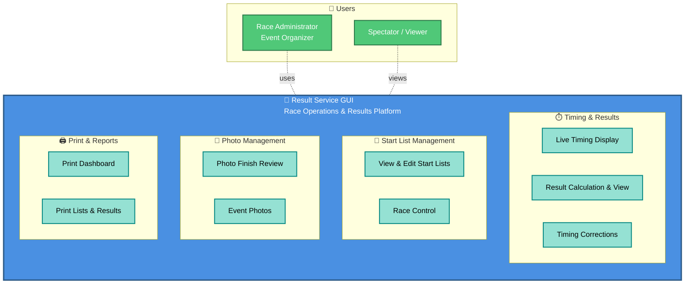
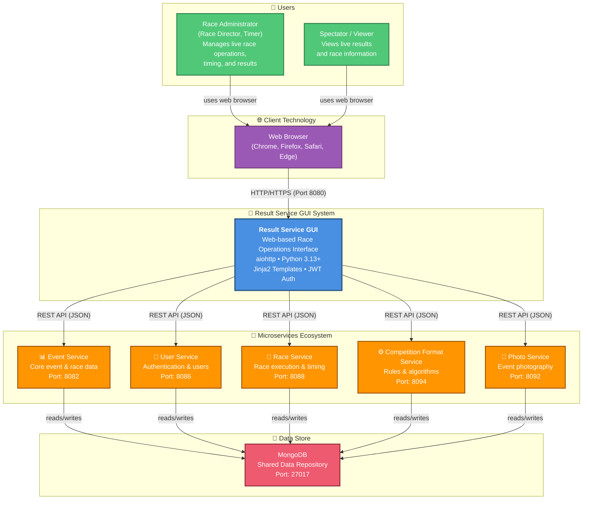

# C4 Context Diagram: System Scope

## What is C4 Context?

The **C4 Context diagram** shows:
- The system being documented (Result Service GUI)
- Who uses it (actors/users)
- What external systems it interacts with
- High-level data flows

## Functional Context (Business View)

What does the system actually do? Here's the functional perspective without technical detail:



**Key Capabilities**:
- ✅ Live race timing and real-time result display
- ✅ Start list management and editing
- ✅ Race control and timing corrections
- ✅ Photo finish review and management
- ✅ Printed reports and race dashboards
- ✅ Video event integration

---

## Technical Context (System Integration View)



## Users/Actors

### **Race Administrator**
**Who**: Race directors, timers, event organizers

**Responsibilities**:
- Monitor live race timing
- Edit and correct start lists
- Review and correct timing results
- Manage photo finish images
- Control race execution
- Generate printed reports and dashboards

**Access**: Web browser, authenticated via login

**Frequency**: Continuous during race events

### **Spectators / Results Viewers**
**Who**: Audience, athletes' family and friends, media

**Responsibilities**:
- View live results and timings
- Follow race progress

**Access**: Web browser, read-only views (open access)

## System Responsibilities

### What Result Service GUI Does ✅

1. **Live Timing Display**
   - Real-time display of timing events
   - Live result calculation and ranking
   - Timing dashboard for race officials

2. **Start List Management**
   - View and edit competitor start lists
   - Control race starts and heat management

3. **Results Management**
   - View and present calculated race results
   - Edit and correct timing entries
   - Export results as CSV

4. **Photo Management**
   - Review photo finish images
   - Update photo metadata
   - Manage event photo galleries

5. **Print & Reports**
   - Generate printable race programs
   - Print result sheets and dashboards

6. **Video Event Integration**
   - View and manage video timing events

### What Result Service GUI Does NOT Do ❌

- **Store business data directly** (delegates to microservices)
- **Execute timing capture** (Race Service handles device input)
- **Manage event configuration** (Event Service GUI handles this)
- **Process payments** (out of scope)
- **Store competitive data permanently** (delegates to microservices)

## External Systems & Dependencies

### **1. Event Service**
**Type**: Microservice REST API
**Port**: 8082 (default)
**Purpose**: Core event and race data management

**Interactions**:
- GET events, raceclasses, and raceplans
- GET/update competitors
- Store event metadata

**Data Format**: JSON

**Failure Impact**: 🔴 Critical - Cannot fetch event data

---

### **2. User Service**
**Type**: Microservice REST API
**Port**: 8086 (default)
**Purpose**: User authentication and management

**Interactions**:
- POST login (authentication)
- Validate JWT tokens
- Get user profile

**Data Format**: JSON + JWT tokens

**Authentication**: JWT Bearer tokens

**Failure Impact**: 🔴 Critical - Cannot authenticate users

---

### **3. Competition Format Service**
**Type**: Microservice REST API
**Port**: 8094 (default)
**Purpose**: Competition rule definitions and templates

**Interactions**:
- Get competition format definitions
- Get seeding algorithm implementation

**Data Format**: JSON

**Failure Impact**: 🟡 High - Some features unavailable

---

### **4. Race Service**
**Type**: Microservice REST API
**Port**: 8088 (default)
**Purpose**: Race execution, timing, and result calculation

**Interactions**:
- GET/update race plans
- GET/update individual race starts
- GET timing events
- GET/update race results

**Data Format**: JSON

**Frequency**: Continuous during races (polling every 1-2 seconds for live updates)

**Failure Impact**: 🔴 Critical - Live race operations unavailable

---

### **5. Photo Service**
**Type**: Microservice REST API
**Port**: 8092 (default)
**Purpose**: Event photo management and storage

**Interactions**:
- View and manage photo finish images
- View photo galleries
- Update photo metadata

**Data Format**: Multipart JSON + image files

**Failure Impact**: 🟢 Low - Photography feature unavailable but not critical

---

### **6. MongoDB**
**Type**: NoSQL Database
**Accessed By**: All microservices
**Purpose**: Shared data store for all microservices

**Data Stored**:
- Events and competitions
- Users and permissions
- Race schedules
- Results and timing data
- Photos and metadata

**GUI Access**: Indirect (only via microservices)

**Failure Impact**: 🔴 Critical - No data available

## Data Flows

### Example: Viewing Live Race Results

```
1. Race official opens Control view in browser
2. Browser polls the Result Service GUI every 1-2 seconds
3. GUI (View) handles GET request
4. Calls TimeEventsAdapter.get_time_events()
5. TimeEventsAdapter calls Race Service API
6. Race Service returns timing events and results
7. ResultAdapter.get_race_results() fetches calculated results
8. Template rendered with live data
9. HTML sent back to browser
10. Race official sees live competitor times and rankings
```

### Example: Correcting a Timing Entry

```
1. Race official identifies incorrect timing
2. Opens Corrections view in browser
3. Selects timing entry and enters corrected time
4. GUI (View) handles POST request
5. Calls TimeEventsService.update_time_event()
6. Service validates the correction
7. TimeEventsAdapter calls Race Service API to update
8. Race Service recalculates results
9. GUI redirects to updated view
10. Corrected result is now displayed
```

## Communication Protocols

### Client ↔ GUI (HTML, HTTP/HTTPS)
- **Protocol**: HTTP/HTTPS
- **Port**: 8080 (HTTP) or 443 (HTTPS via reverse proxy)
- **Method**: Request/Response
- **Content-Types**: HTML, JSON, Form-encoded

### GUI ↔ Microservices (REST/JSON)
- **Protocol**: HTTP (internal network)
- **Ports**: 8082, 8086, 8088, 8092, 8094
- **Method**: Request/Response (REST)
- **Content-Type**: JSON
- **Authentication**: JWT Bearer tokens
- **Async**: Yes (non-blocking calls)

### Microservices ↔ MongoDB
- **Protocol**: MongoDB Wire Protocol
- **Port**: 27017 (default)
- **Access**: Native MongoDB driver

## Service Discovery

### Configuration Method
- **Environment Variables** (deployment-time)
  - `EVENTS_HOST_SERVER` + `EVENTS_HOST_PORT`
  - `USERS_HOST_SERVER` + `USERS_HOST_PORT`
  - `RACE_HOST_SERVER` + `RACE_HOST_PORT`
  - `PHOTOS_HOST_SERVER` + `PHOTOS_HOST_PORT`
  - `COMPETITION_FORMAT_HOST_SERVER` + `COMPETITION_FORMAT_HOST_PORT`

### Development
- All services on `localhost`
- Service ports configurable via environment variables

### Production
- Services accessible by hostname (not IP)
- DNS resolution for service discovery
- Load balancers distribute requests

## System Boundaries

### Inside the Boundary (GUI Scope)
✅ Presentation layer (templates)
✅ Request routing (views)
✅ Business logic orchestration (services)
✅ Service abstraction (adapters)
✅ User authentication/authorization
✅ Session management
✅ Configuration loading

### Outside the Boundary (Not GUI Responsibility)
❌ Event data persistence (Event Service)
❌ User credential validation (User Service)
❌ Competition rule algorithms (Format Service)
❌ Race timing capture (Race Service)
❌ Photo storage (Photo Service)
❌ Database management (MongoDB)

## Context Diagram Interpretation

The context diagram shows:

1. **Two Actors** (Race Administrator, Spectator)
   - Interact through web browser
   - Admins have full access; spectators have read-only access

2. **One System** (Result Service GUI)
   - Central hub for race operations and result display
   - Orchestrates calls to microservices
   - Stateless and scalable

3. **Five External Systems** (Microservices)
   - Independent deployment
   - Own databases or shared MongoDB
   - Expose REST APIs
   - Can fail independently

4. **Data Flows**
   - Browser → GUI: Forms and HTTP requests
   - GUI → Microservices: REST API calls
   - Microservices → MongoDB: Data persistence
   - GUI ← Microservices: JSON responses
   - Browser ← GUI: HTML pages

## Understanding System Boundaries

### Context Level
Asks: "What is this system?"
Answer: "Web interface for live race operations and result display"

### Container Level
Asks: "How does it work?"
Answer: "Web app + loadbalancer + database cluster"

### Component Level
Asks: "What parts does it have?"
Answer: "Views, Services, Adapters, Templates"

### Code Level
Asks: "How is it built?"
Answer: "Python classes, async functions, REST clients"

This diagram represents the **Context level** of the C4 model.

---

**Next**: Review [C4 Container Diagram](03_c4_container.md) to understand the internal containers and technologies.
