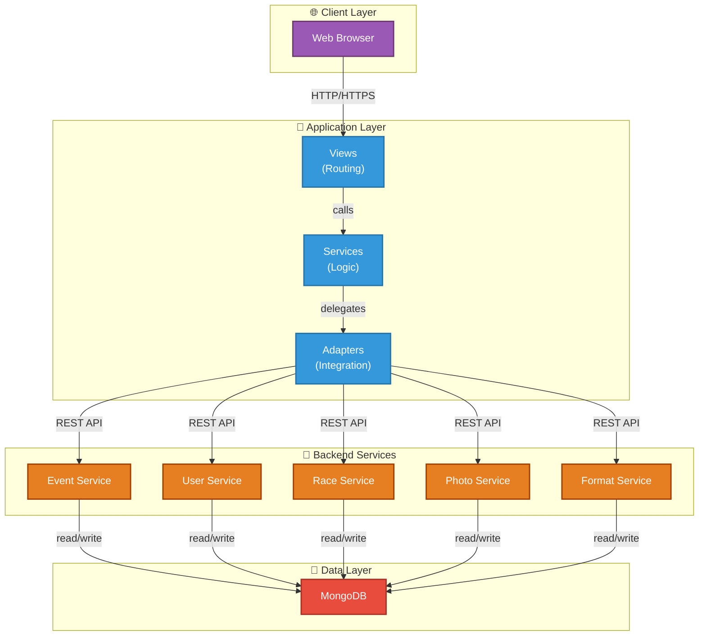

# Architecture Documentation

This folder contains comprehensive C4 Model architecture documentation for the Result Service GUI project.

## 🎯 Purpose

Document the system architecture for **technical leads and architects** using the **C4 Model** with **high-level detail** on design patterns, interfaces, and specifications.

## 📚 Quick Navigation

### Getting Started
👉 **Start here**: [Index & Overview](00_index.md)

Then follow based on your role:

#### 🏗️ Understanding Architecture
1. [Architecture Overview](01_architecture_overview.md) - Design principles
2. [C4 Context](02_c4_context.md) - System scope
3. [C4 Container](03_c4_container.md) - Deployable components *(in progress)*
4. [C4 Components](04_c4_components.md) - Internal modules *(in progress)*

#### 📊 Technical Details
- [Data Models](05_data_models.md) - Domain entities *(in progress)*
- [Design Patterns](06_design_patterns.md) - Architectural patterns *(in progress)*
- [Integration Points](07_integration_points.md) - Microservice details *(in progress)*

#### 🚀 Operations
- [Deployment Architecture](08_deployment.md) - Infrastructure *(in progress)*

## 📊 Current Analysis

```
Project Metrics:
- 8,129 lines of Python code
- 25 view components
- 18 service adapters
- 22 HTML templates
- 5 external microservices
- MongoDB shared database
```

## 🏛️ Architecture at a Glance



## 📖 Reading Guide by Role

### 👨‍💼 **Architect / Technical Lead**
1. Read [Architecture Overview](01_architecture_overview.md)
2. Review [C4 Context](02_c4_context.md) & [Container](03_c4_container.md)
3. Deep dive: [Design Patterns](06_design_patterns.md)
4. Planning: [Deployment Architecture](08_deployment.md)

### 👨‍💻 **Developer (New to Project)**
1. Start: [Architecture Overview](01_architecture_overview.md)
2. Understand: [C4 Components](04_c4_components.md)
3. Reference: [Data Models](05_data_models.md)
4. Learn: [Design Patterns](06_design_patterns.md)

### 🚀 **DevOps / Infrastructure**
1. Review: [C4 Container](03_c4_container.md)
2. Deep dive: [Deployment Architecture](08_deployment.md)
3. Reference: [Integration Points](07_integration_points.md)

### 🧪 **QA / Test Lead**
1. Overview: [Architecture Overview](01_architecture_overview.md)
2. Component: [C4 Components](04_c4_components.md)
3. Integration: [Integration Points](07_integration_points.md)

## 🎓 Understanding C4 Model

The documentation uses the **C4 Model** for architecture documentation:

### Level 1: Context
**What does the system do?**
- System scope and boundaries
- Users and external systems
- High-level data flows

**File**: [02_c4_context.md](02_c4_context.md)

### Level 2: Container
**What are the main parts?**
- Deployable units (Docker containers, services)
- Technologies used
- High-level interactions

**File**: [03_c4_container.md](03_c4_container.md) *(in progress)*

### Level 3: Component
**How are those parts built?**
- Internal modules and classes
- Component responsibilities
- Detailed interactions

**File**: [04_c4_components.md](04_c4_components.md) *(in progress)*

### Level 4: Code
**What about the code?**
- Class diagrams
- Method signatures
- Code examples

**Referenced in**: [Design Patterns](06_design_patterns.md) *(in progress)*

## 🔧 Key Technologies

| Component | Technology |
|---|---|
| Framework | aiohttp (async Python) |
| Language | Python 3.13+ |
| Frontend | Jinja2, HTML5, CSS3, JavaScript |
| Auth | JWT tokens |
| Database | MongoDB |
| Server | Gunicorn |
| Container | Docker |

## 🏛️ Key Patterns

- **Adapter Pattern** - Service abstraction
- **Facade Pattern** - Simplified interfaces
- **MVC Pattern** - Separation of concerns
- **Template Method** - UI consistency
- **Decorator Pattern** - Reusable functionality

## 📡 External Services

```
Event Service       → Core event data
User Service        → Authentication
Race Service        → Timing & results
Format Service      → Competition rules
Photo Service       → Event photography
```

## ✅ Documentation Status

| Document | Status | Details |
|---|---|---|
| 00_index.md | ✅ Complete | Navigation and overview |
| 01_architecture_overview.md | ✅ Complete | Design principles |
| 02_c4_context.md | ✅ Complete | System scope |
| 03_c4_container.md | 📝 Template | Deployable components |
| 04_c4_components.md | 📝 Template | Internal modules |
| 05_data_models.md | 📝 Template | Domain entities |
| 06_design_patterns.md | 📝 Template | Patterns & practices |
| 07_integration_points.md | 📝 Template | Microservice details |
| 08_deployment.md | 📝 Template | Infrastructure |

Templates are ready to be filled in with your specific content.

---

Last Updated: 2026
Standard: C4 Model
Level: High Detail
Audience: Technical Leads & Architects
